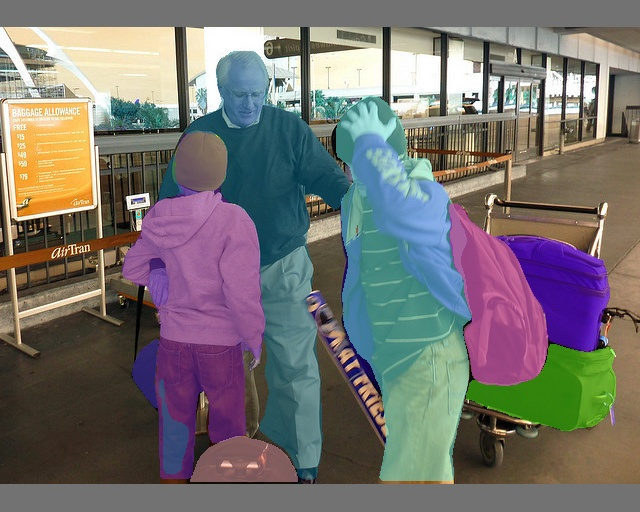
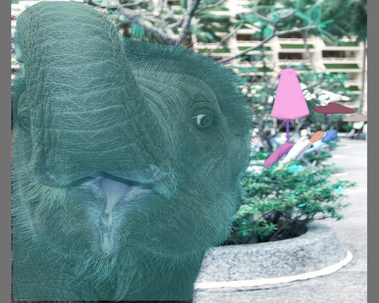
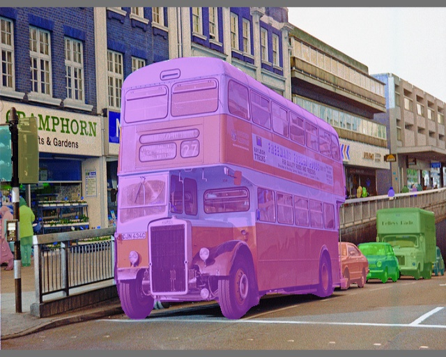
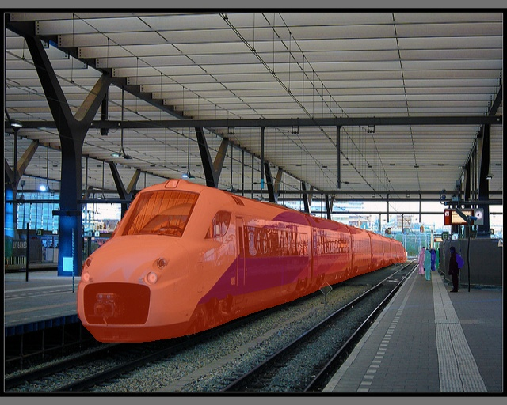
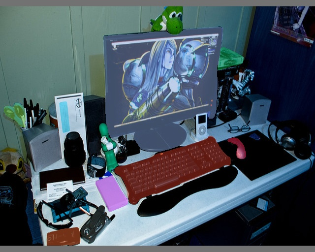

# Yolov7 Segmentor with TensorRT
 **This repository implement the real-time Instance Segmentation Algorithm named Yolov7 with TensoRT.**
 
## Some remarks 
  - The initial repository on which I build mine is from **WongKinYiu/yolov7**__ repository (https://github.com/WongKinYiu/yolov7)), for additional information about the installation of Yolov7, refer to the original repository. 
  - This project is built upon the excellent framework detectron2, and you should install detectron2 first, please check official installation guide for more details. (https://github.com/facebookresearch/detectron2.git)
  - For command other than TensoRT and ONNX inference, please refer to the initial repository (e.g detect.py). 
  - If you face any problem during the parsing time, don't hesitate to drop an issue.
  - Be aware that in order to parse the model to ONNX and TensorRT, some originals files has been modified/slightly modified, don't forget to check the modifications if you come from the initial repository.
  
 
 ## Installation and dependencies
 <details>
  <summary>Click me</summary>
    - Install Pytorch (1.10.0) and TorchVision (0.11.1)
      ```js
      pip3 install torch torchvision torchaudio --extra-index-url https://download.pytorch.org/whl/cu116
      
      If other versions of torch are needed, select yours by putting torch==1.11.0+cu102 for example.
      ```
    - Install CUDA (10.2) and cuDNN (8.0.0) : https://developer.nvidia.com/cuda-downloads?target_os=Linux&target_arch=x86_64&Distribution=WSL-Ubuntu&target_version=2.0&target_type=deb_local
    
      - For WSL-Ubuntu :
      ```js
      sudo wget https://developer.download.nvidia.com/compute/cuda/repos/wsl-ubuntu/x86_64/cuda-wsl-ubuntu.pin
      sudo mv cuda-wsl-ubuntu.pin /etc/apt/preferences.d/cuda-repository-pin-600
      sudo wget https://developer.download.nvidia.com/compute/cuda/11.7.1/local_insta
          llers/cuda-repo-wsl-ubuntu-11-7-local_11.7.1-1_amd64.deb
      sudo dpkg -i cuda-repo-wsl-ubuntu-11-7-local_11.7.1-1_amd64.deb
      sudo cp /var/cuda-repo-wsl-ubuntu-11-7-local/cuda-96193861-keyring.gpg /usr/share/keyrings/
      sudo apt-get update
      sudo apt-get -y install cuda
      ```
    
    - Install TensorRT (8.0.1.6), if you are using an nvidia edge device, TensorRT should already be installed
      ```js
      python3 -m pip install --upgrade setuptools pip
      python3 -m pip install nvidia-pyindex
      python3 -m pip install --upgrade nvidia-tensorrt
      
      Verify installation by writing  : assert tensorrt.Builder(tensorrt.Logger())
      ```
    - Install ONNX and ONNXruntime
      ```js
      pip install onnxruntime-gpu
      pip install onnxruntime
      pip install numpy protobuf==4.21.5  
      pip install onnx
      ```
    - Install all the other packages needed to run the original SparseInst algorithm (Should be done if you have installed Dectectron2)

 </details>

 
 ## Models and Results for TensorRT and ONNX inference script:
 
 The inference speed for TensorRT are shown in the table below. Yolov7 running with TensoRT achieved more a less 3 times faster inference speed than Yolov7 running with Pytorch. Lowering the input size of the image can lead to a decent real-time speed.  
 The models from TensorRT and ONNX are built upon the Pytorch weights : Yolov7-mask.pt : https://github.com/WongKinYiu/yolov7/releases/download/v0.1/yolov7-mask.pt .
 
 *Note: All the computations has been done on a Nvidia Jetson TX2 Jetpack 4.6.*
 
 | Model | Input Size |  Inference Speed 
| :---         |     :---:      |     ---: |
| TensorRT     | 320    |  14.00 FPS    |
| TensorRT     | 640    |  5.00 FPS     |


  Instance Segmentation  with           |  Yolov7 TensorRT
:-------------------------:|:-------------------------:
  |  
  |  
  |  
 

 ## Building the ONNX model  :
 
 To build the model from Pytorch to ONNX, you need to run the following command. You can set the arguments to default. Please check if the config path and the model weights path are correctly set up.
 ```
 mkdir onnx && python3 export_mask.py --weights ./yolov7-mask.pt  --topk-all 100 --iou-thres 0.65 --conf-thres 0.35 --imgsz $imgsz --input $input_image_path
 ```
 The onnx file will be saved in the created onnx directory. The input that you give will be infered right after the export operation to verify if the export was successful. if you don't want to infer the image, just add --no_infer.
 
  ## Building the TensorRT model  :
  
  To build the model from ONNX to TensorRT, you need to run the following command. You can set the arguments to default. If you have any problem while parsing the model to TensorRT, don't hesitate to ask. The exportation is based on the repository TensorRT-For-YOLO-Series (https://github.com/Linaom1214/TensorRT-For-YOLO-Series).
 ```
 git clone https://github.com/Linaom1214/TensorRT-For-YOLO-Series.git
 mkdir engine && python3  ./tensorrt-python/export.py -o $onnx_file_path -e $./engine/engine_name.engine -p fp16
 ```
 
  ## Testing Yolov7 with Pytorch, TensorRT and ONNX :
  **TensorRT**

  To test the inference speed (FPS) of the TensorRT model, run the following command. 

 ```
 python3  segment_image.py --input $input_image_path   --model $tensorrt_engine_path --onnx_model $onnx_model_path  --imgsz $image_size
 ```

 You can still find the ONNX inference in the export_mask.py if you need it. 

 
**Notes :**
- **Input argument** can either be an image or a directory of images (directory/*)
 
 ## Visualizing Yolov7 with TensorRT :
 **TensorRT**
  1. To visualize segmentation results on your **images**, you can run the following commands : 
 
 
 ```
python3  segment_image.py --input $input_image_path   --model $tensorrt_engine_path --onnx_model $onnx_model_path --imgsz $image_size --save_image --save_path $result_directory_path
 ```
 2. To visualize segmentation results on your **video**, you can run the following commands : 
 ```
python3  segment_video.py --input $input_video_path   --model $tensorrt_engine_path --onnx_model $onnx_model_path  --imgsz $image_size --save_video --save_path $result_directory_path/video_name.mp4
 ```

**Notes :**
- If you don't specify --save_image or --save_video, it will only infer the model and not save the outputs.


 
